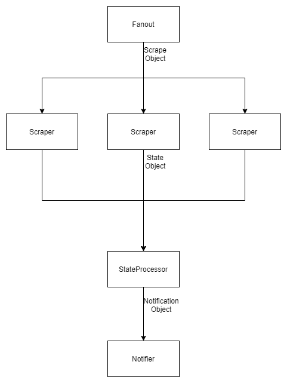
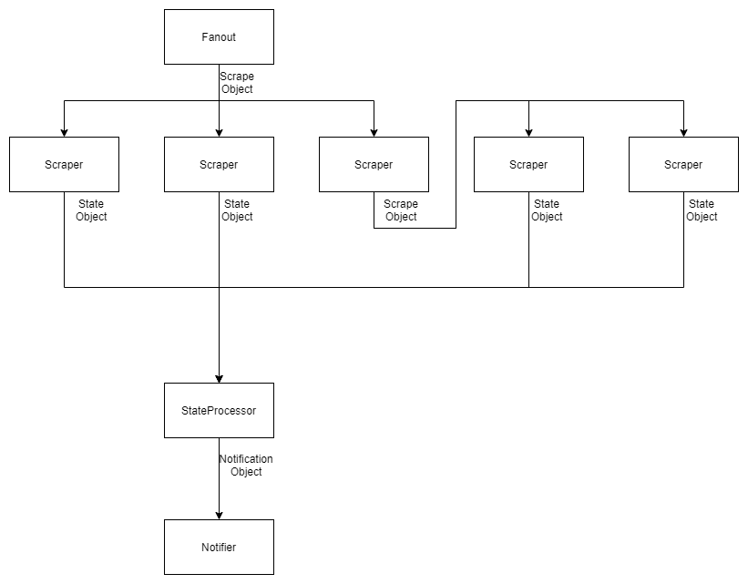
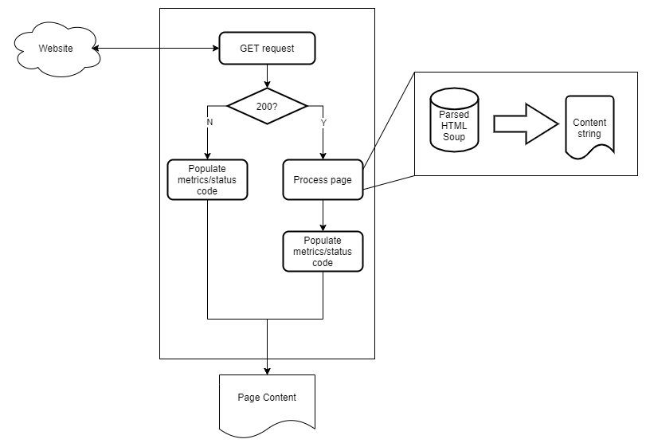

# Scraper Pipeline

## Overview

`scraper_pipeline` is a package that helps compartmentalize scraping of a web
page to notify when the state of a certain part of a web page has changed
(for example, if an e-commerce website changes a product from "Out of Stock"
to "Add to Cart").

The scraping process follows the following 4 basic steps:
  1. Fanout (kick off the scraping)
  2. Scrape
  3. Process
  4. Notify

## Data Flow

`scraper_pipeline` uses rudimentary [models](scraper_pipeline/models) that
are backed by Python's `NamedTuple` to ensure a pseudo-contract between the
different steps of the process. `NamedTuple` has an `_asdict()` method that
allows the model to be written to a dict/json. Conversely, an instance of the
model can be created from dict/json via the reverse
(`models.<model>.<ModelClass>(**obj)`). Using this method, the models can be
serialized and deserialized, allowing the different steps of the pipeline to
operate in different runtimes.

### Simple

A simple example of data flowing between the steps of the pipeline can be
seen below.

In this example, the fanout step generates 3 different scrape objects (so 3
different pages to scrape). Each scraper then scrapes and processes the page
to extract the state of the page. The state is then processed by the
`StateProcessor`, and if the state of the page has changed, a notification
object is generated for the `Notifier` to handle

### Recursive

A more complex use case for the pipeline would be to have scrapers feed into
other scrapers (e.g. scraping links to recursively crawl a website). This is
the diagram for how data would flow between components in this use case.

In this example, the fanout step generates 3 different scrape objects. Two of
the scraper objects have no extra processing to be done, so they output a
state object for the state processor to handle. The last scraper object
created more scrape objects to pass to other scrapers, which then processed
to final state objects.

It should be noted that the
`scraper_pipeline.scrape.scraper.Scraper.scrape()` method does only output a
`PageContent` object, so the information for the recursive scrape objects
will need to be encoded in the `PageContent.content` member to then be
decoded and fanned out into further scrapes.

### Anatomy of a scraper

A scraper is a class that handles the request to an external website and the
parsing of the returned HTML values. The scraper needs to be provided a
processor that can turn the HTML soup into a content string.

If the website did not return a 200 on the GET request, it will skip the
processing step (as the parsed HTML soup will no longer be conforming to the
expected HTML format of the processor).